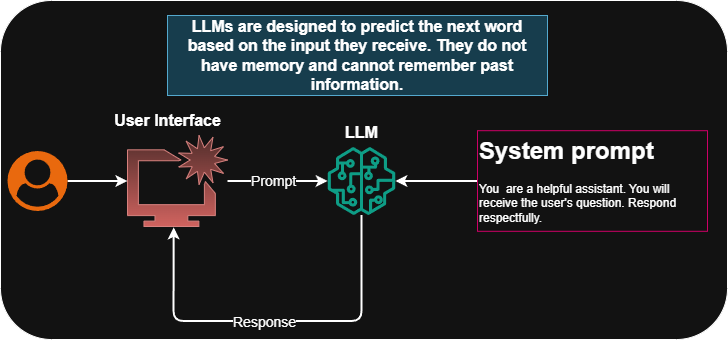
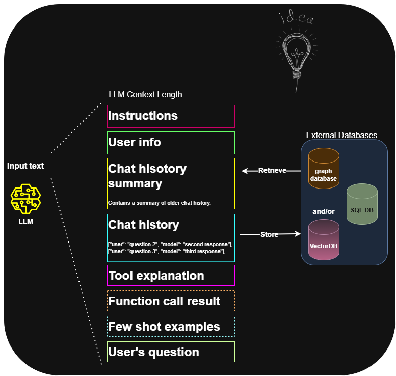
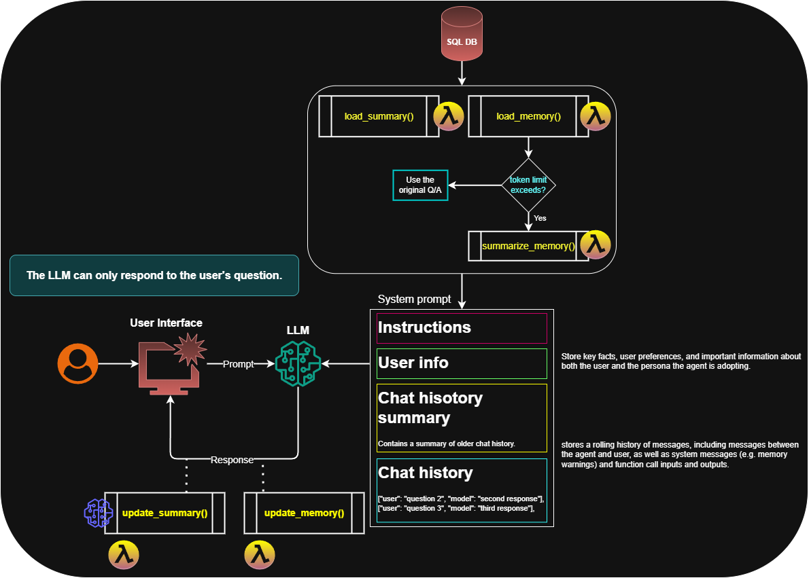
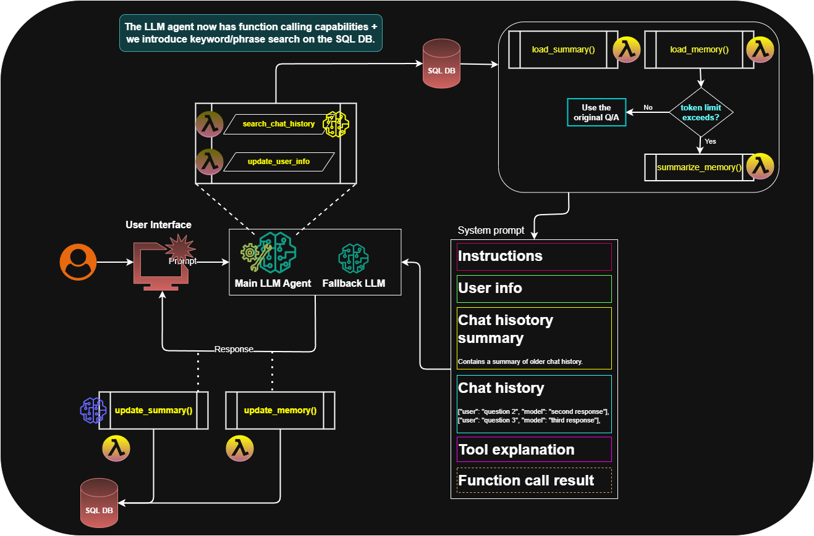
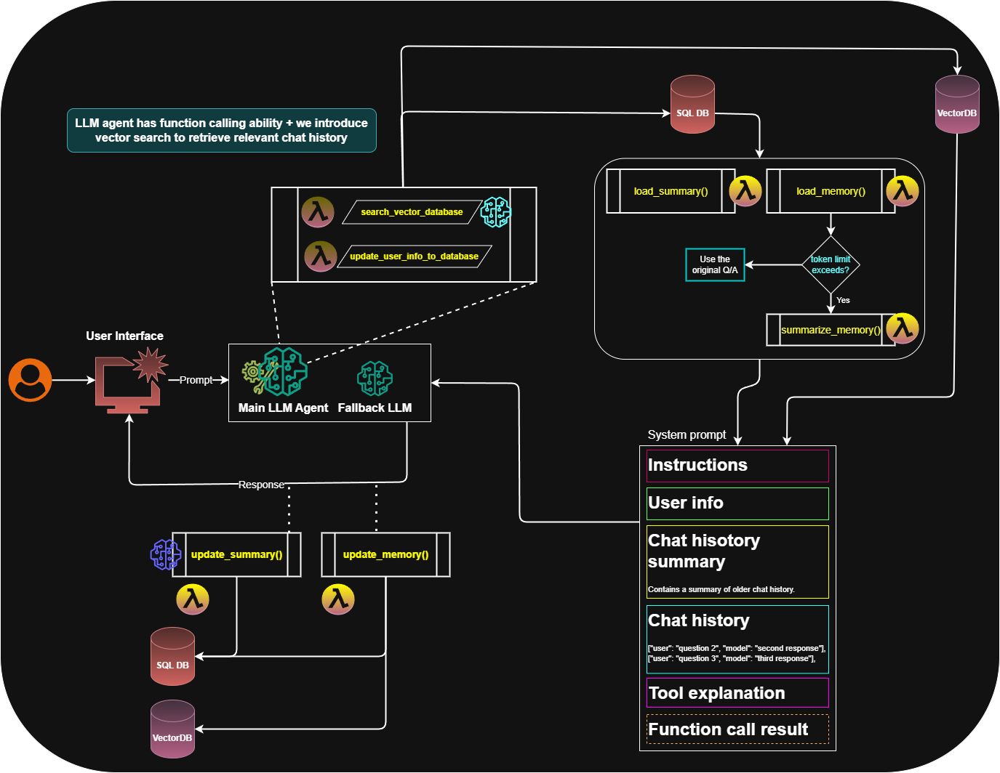

# 🧠 Agentic Long-Term Memory

This project explores the concept of long-term memory in AI agents and demonstrates how to build agentic memory systems using various approaches and tools. 

Feel free to ⭐️ the repo if it helps you understand long-term memory for agents!


## 💾 How to Run the Project

⚠️ Note: Please use Python 3.11 as Python 3.12 may cause compatibility issues with some dependencies.

1. **Create a virtual environment**  
   ```bash
   python -m venv venv
   source venv/bin/activate  # or venv\Scripts\activate on Windows
   ```
2. Install dependencies
    ```bash
    pip install -r requirements.txt
    ```
3. Prepare the databases for the custom chatbot
    ```bash
    python src/prepare_sqldb.py          # Setup SQLite DB  
    python src/prepare_vectordb.py       # Setup Vector DB  
    ```
4. Run the chatbots
    - Run in terminal:
        ```bash
        python src/chat_in_terminal.py
        ```
    - Run with Gradio UI (all 3 chatbot versions available):
        ```bash
        python src/chat_in_ui.py
        ```
    
# Project Schemas:
**LLM Default Behavior**



**Concept of Memory**



**Basic Chatbot Schema**



**Agentic_Chatbot_v2 Schema**



**Agentic_Chatbot_v3 Schema**




🧩 Technologies Used
- Python
- mistralai
- SQLite
- Chroma (Vector DBs)
- Gradio (UI)

📂 Project Structure (High-Level)
```bash
src/
├── chat_in_terminal.py        # Terminal-based chatbot
├── chat_in_ui.py              # Gradio UI version
├── prepare_sqldb.py           # Creates SQLite DB
├── prepare_vectordb.py        # Creates Vector DB
└── utils/
    ├── chat_history_manager.py
    ├── chatbot_agentic_v1.py
    ├── chatbot_agentic_v2.py
    ├── chatbot.py
    ├── config.py
    ├── prepare_system_prompt.py
    ├── search_manager.py
    ├── sql_manager.py
    ├── user_manager.py
    ├── utils.py
    └── vector_db_manager.py

data/
├── vectordb/
└── chatbot.db

images/

├── requirements.txt
```